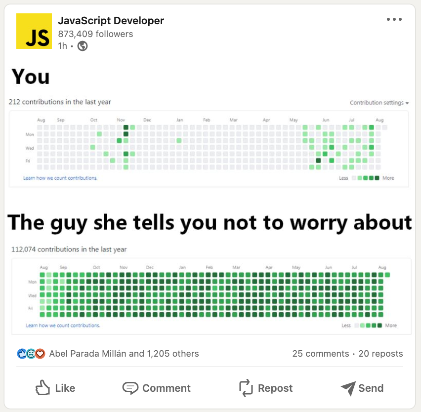
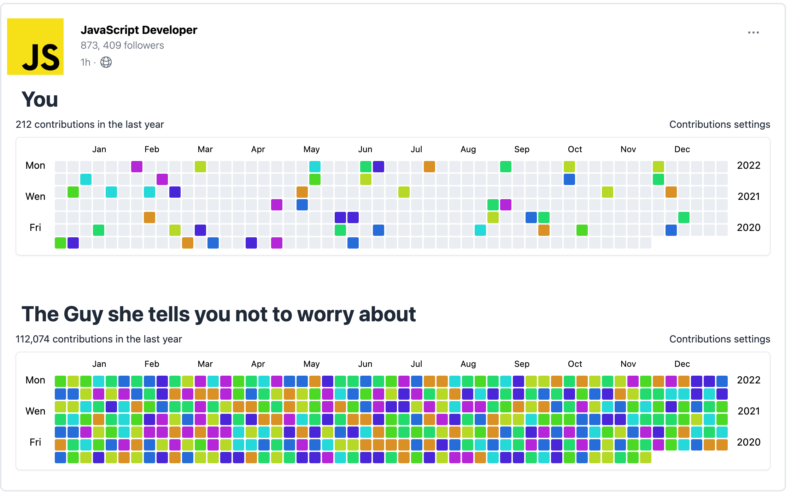

# Github Contributions calendar clone

## 1. What is this?

This project was motivated by [this]("https://www.linkedin.com/posts/javascript-developer_activity-7001843025769308161-qvvS?utm_source=share&utm_medium=member_desktop") LinkedIn post by [JavaScript Developer ] ("https://www.linkedin.com/company/javascript-developer")

- The app uses [React]("https://reactjs.org/") and Tailwind CSS to display the list of contributions made by the user on GitHub and the number of contributions made on each day of the week.
- Its a clone of the [GitHub Contributions Calendar]("https://docs.github.com/en/account-and-profile/setting-up-and-managing-your-github-profile/managing-contribution-settings-on-your-profile/why-are-my-contributions-not-showing-up-on-my-profile")

## 2. Demos

### [Demo of the app](https://github-contributions-omega.vercel.app/)

### Screenshot of inspiration post

### Screenshot of the app

NOTE : Does not work for private repositories

## 3. Available Scripts

In the project directory, you can run:

### `npm start`

- Runs the app in the development mode.\
  Open [http://localhost:3000](http://localhost:3000) to view it in the browser.

### `npm test`

- Launches the test runner in the interactive watch mode.\
  See the section about [running tests](https://facebook.github.io/create-react-app/docs/running-tests) for more information.

### `npm run build`

- Builds the app for production to the `build` folder.\
  It correctly bundles React in production mode and optimizes the build for the best performance.

- The build is minified and the filenames include the hashes.\
  Your app is ready to be deployed!

- See the section about [deployment](https://facebook.github.io/create-react-app/docs/deployment) for more information.

## 3. Learn More

1. You can learn more in the [Create React App documentation](https://facebook.github.io/create-react-app/docs/getting-started).

2. To learn React, check out the [React documentation](https://reactjs.org/).

3. Learn Tailwind CSS [here]("https://tailwindcss.com/docs")

4. Learn GitHub API [here]("https://docs.github.com/en/rest")

5. Github Contributions Calendar [here]("https://docs.github.com/en/account-and-profile/setting-up-and-managing-your-github-profile/managing-contribution-settings-on-your-profile/why-are-my-contributions-not-showing-up-on-my-profile")

## 5. Contributing

Pull requests are welcome. For major changes, please open an issue first to discuss what you would like to change.

Please make sure to update tests as appropriate.
